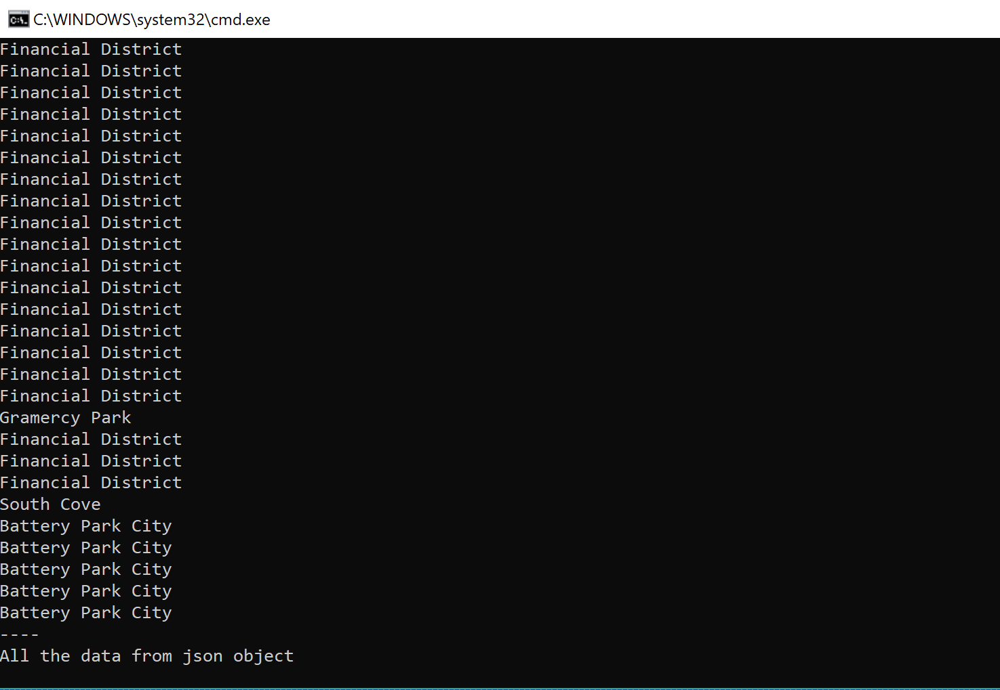

# Lab08-LINQ-in-Manhatten

This is a demonstration and practice for taking in a JSON file, deserializing it and utilizing LINQ and Lambda expressions to affect the data in specific ways. This is built in the C# language and Visual Studio IDE.

The LINQ expressions used in this project display all data, removes empty strings, removes duplicates and one LINQ expression that combines all three. There is a Lambda expression that also has the same functionality of the larger LINQ statement.
***
## Getting Started
* Download the Lab07-Collections project
* After it's been downloaded, navigate to the .csproject file and open up Visual Studio. It is built using the latest .NET 2.1 SDK
* Once the project is opened, run it with or without debug and a console should appear. If the below image is what you are greeted with then success! You can see a the LINQ in action
***
## What it should look like

***
## Resources Used
* [Newtonsoft.Json](https://www.newtonsoft.com/json) - For json serialization
* [Stack Overflow](https://stackoverflow.com/) - General LINQ implementation
